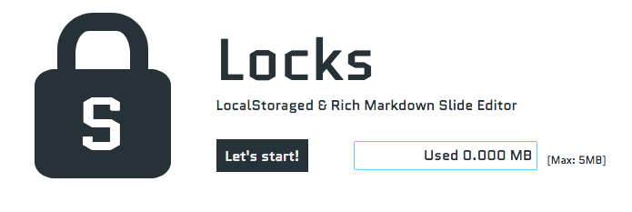

# Locks



Anyone available! Try [Locks](https://yymm.github.io/locks/#/ "Locks") now!

# What's about?

See ==> [What's about Locks?](https://goo.gl/Pdtdy3)

## for Developer

``` bash
# install dependencies
npm install

# serve with hot reload at localhost:8080
npm run dev

# build for production with minification
npm run build

# create gh-pages(docs/)
npm run docs
```
